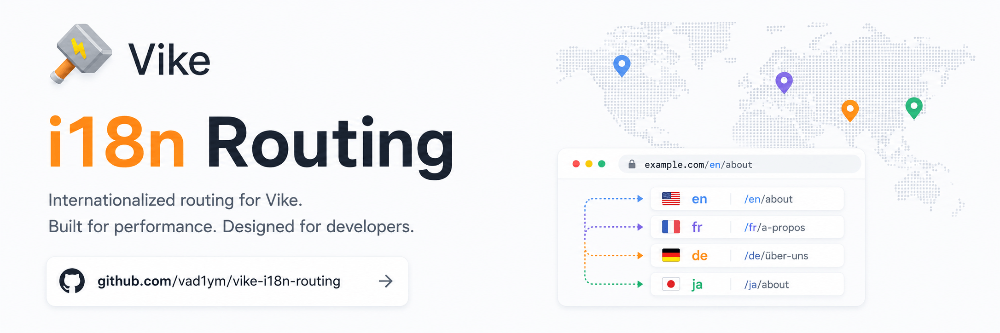

# vike-i18n-routing

<div align="center">

**I18n routing for Vike with localized URLs, canonical route mapping, translated params, and domain-aware locale config**

<picture>
  <source media="(prefers-color-scheme: dark)" srcset="./.github/assets/banner-dark.png">
  <source media="(prefers-color-scheme: light)" srcset="./.github/assets/banner.png">
  
</picture>

[](https://www.npmjs.com/package/vike-i18n-routing)
[](https://www.npmjs.com/package/vike-i18n-routing)
[](./LICENSE)

[**Documentation**](https://vad1ym.github.io/vike-i18n-routing/) • [**Quick Start**](https://vad1ym.github.io/vike-i18n-routing/guide/quick-start) • [**API**](https://vad1ym.github.io/vike-i18n-routing/guide/use-i18n-route)

</div>

## Overview

`vike-i18n-routing` lets you keep canonical routes in code while exposing localized public URLs:

- `/en/about`
- `/ru/o-nas`
- `/fr/a-propos`

It resolves localized requests back to canonical routes, normalizes invalid locale/path combinations, and provides helpers to generate localized URLs at runtime.

## Features

- Canonical route mapping with localized public URLs
- Locale prefixes with optional unprefixed default locale
- Dynamic route patterns with `@param` syntax (alias for `path-to-regexp` `:param`)
- Translated route params with automatic URL normalization
- Translated query-string variants for localized filters and links
- Locale detection from URL, query, cookies, session, and `Accept-Language`
- Per-domain locale configuration
- Runtime helpers for localized links, alternates, and route metadata

## Installation

```bash
# npm
npm install vike-i18n-routing

# yarn
yarn add vike-i18n-routing

# pnpm
pnpm add vike-i18n-routing
```

Peer dependency:

- `vike >= 0.4.259`

## Quick Start

```ts
// +config
import vikeVue from 'vike-vue/config'
import vikeI18n from 'vike-i18n-routing/config'
import type { Config } from 'vike/types'
import type { I18nConfig } from 'vike-i18n-routing'

export default {
  extends: [vikeVue, vikeI18n],

  i18n: {
    defaultLocale: 'en',
    locales: ['en', 'ru'],
    prefixDefaultLocale: true,
    routes: {
      '/': { en: '/', ru: '/' },
      '/about': { en: '/about', ru: '/o-nas' },
    },
  } satisfies I18nConfig,
} satisfies Config
```

With this config:

- `/en/about` resolves to canonical `/about`
- `/ru/o-nas` resolves to canonical `/about`
- `/about` redirects to `/en/about`
- `/ru/about` redirects to `/ru/o-nas`

## Runtime Example

Vue:

```ts
import { useI18nRoute } from 'vike-i18n-routing/vue'
import { usePageContext } from 'vike-vue/usePageContext'

const pageContext = usePageContext()
const { locale, routeConfig, localizePath } = useI18nRoute(pageContext)

localizePath('/about')
localizePath(routeConfig.value.canonicalUrl, 'ru')
```

React:

```ts
import { useI18nRoute } from 'vike-i18n-routing/react'
import { usePageContext } from 'vike-react/usePageContext'

const pageContext = usePageContext()
const { locale, routeConfig, localizePath } = useI18nRoute(pageContext)

localizePath('/about')
localizePath(routeConfig.canonicalUrl, 'ru')
```

Solid:

```ts
import { useI18nRoute } from 'vike-i18n-routing/solid'
import { usePageContext } from 'vike-solid/usePageContext'

const pageContext = usePageContext()
const { locale, routeConfig, localizePath } = useI18nRoute(pageContext)

localizePath('/about')
localizePath(routeConfig().canonicalUrl, 'ru')
```

## Params And Query Translation

Route patterns and translated param values are configured separately.

```ts
// +config
routes: {
  '/services/@item': {
    en: '/services/@item',
    ru: '/uslugi/@item',
  },
}
```

```ts
import { useI18nRoute } from 'vike-i18n-routing'

const { setRouteParamVariants } = useI18nRoute(pageContext)

setRouteParamVariants('item', {
  en: 'web-development',
  ru: 'veb-razrabotka',
})
```

When variants are registered during data loading, URL normalization happens automatically.

```ts
const { setRouteQueryVariants } = useI18nRoute(pageContext)

setRouteQueryVariants('focus', {
  en: 'frontend',
  ru: 'frontend-ru',
})
```

This keeps query filters localized across redirects and locale switches.

## Domains

```ts
// +config
i18n: {
  defaultLocale: 'en',
  locales: ['en', 'ru', 'fr'],
  domains: {
    'site.com': {
      defaultLocale: 'en',
      locales: ['en', 'ru'],
    },
    'site.fr': {
      defaultLocale: 'fr',
      locales: ['fr', 'en'],
      prefixDefaultLocale: false,
    },
  },
}
```

## Static Generation

`generateStaticPaths()` currently supports only static routes.

```ts
import { generateStaticPaths } from 'vike-i18n-routing'

export { onBeforePrerenderStart }

async function onBeforePrerenderStart() {
  return await generateStaticPaths(i18nConfig)
}
```

Dynamic routes are skipped with a warning for now. If `domains` is configured, it is also ignored with a warning because static output for domain-based routing is not supported yet.

## Documentation

- Docs: `pnpm docs:dev`
- Build: `pnpm docs:build`
- Site: https://vad1ym.github.io/vike-i18n-routing/

## License

MIT
